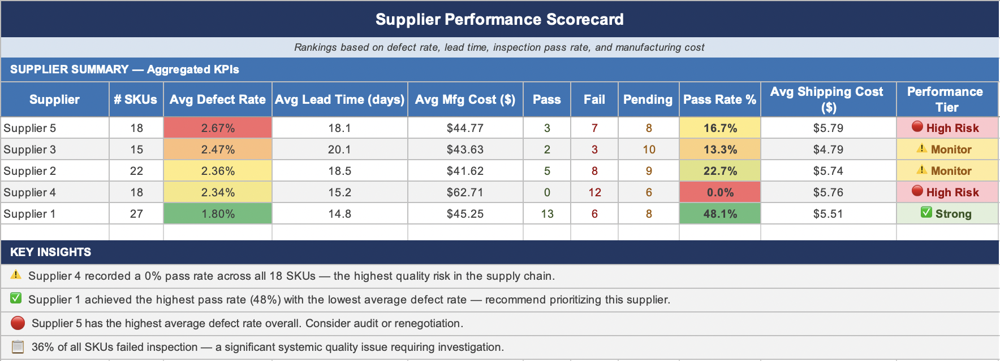

# Supply Chain Performance Analysis

**Tools:** SQL (SQLite) · Excel · Interactive Dashboard · GitHub  
**Dataset:** 100 SKUs across haircare, skincare, and cosmetics product lines

## Live Dashboard
[Click here to view the interactive dashboard](https://maximusmorales.github.io/supply-chain-performance-analysis/supply_chain_dashboard.html)

## Project Overview
This project analyzes an end-to-end supply chain dataset to identify cost drivers, supplier quality issues, and logistics inefficiencies. The goal is to surface actionable recommendations that reduce cost and improve delivery performance.

## Business Questions Answered
- Which product categories generate the most revenue, and is pricing aligned with demand?
- Which suppliers have the highest defect rates and slowest lead times?
- Which shipping routes and carriers cost the most relative to revenue?
- Which SKUs are unprofitable when all supply chain costs are factored in?

## Key Findings
- Supplier 4 had a 0% inspection pass rate across 18 SKUs — the highest quality risk in the dataset
- Supplier 1 outperformed all others with a 48% pass rate and the lowest average defect rate
- Road transport has the highest cost as % of revenue (10.2%) despite being the most used mode
- Sea freight is the most cost-efficient transport mode at 7.4% cost-to-revenue ratio
- 36% of SKUs failed inspection — representing significant quality exposure across the supply chain

## SQL Highlights
The analysis includes 13 queries across 5 sections covering revenue overview, supplier quality scoring, logistics cost breakdown, margin analysis, and executive KPIs. Techniques used include CTEs, window functions, conditional aggregation, and subqueries.

## Files
| File | Description |
|------|-------------|
| `supply_chain_analysis.sql` | All 13 SQL queries with comments |
| `supply_chain_dashboard.xlsx` | Cleaned data, pivot tables, supplier scorecard |
| `supply_chain_dashboard.html` | Interactive 3-page web dashboard |
